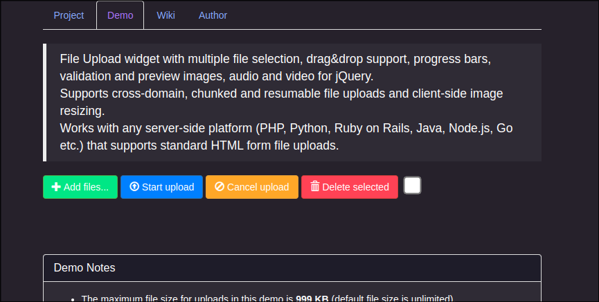

## Descrição
- Esse é um projeto desenvolvido durante o programa de estágio do PRODAP, no qual foi necessário o desenvolvimento de uma Widget de Upload de Arquivos para ser integrado em uma aplicação em produção do PRODAP.
- Ele consiste em servidor web feito em PHP e uma interface usando Jqery, HTML, CSS e Java Script.
- O objetivo do projeto era a possibilidade de realizar o upload de arquivos para o sistema como: (documentos de identificação, processos, clásulas de contratos etc...)

## Funcionalidades

- Upload de vários arquivos:
Permite selecionar vários arquivos de uma vez e carregá-los simultaneamente.
- Suporte para arrastar e soltar:
Permite carregar arquivos arrastando-os da sua área de trabalho ou gerenciador de arquivos e soltando-os na janela do seu navegador.
- Barra de progresso do upload:
Mostra uma barra de progresso indicando o progresso do upload para arquivos individuais e para todos os uploads combinados.
- Uploads canceláveis:
Uploads de arquivos individuais podem ser cancelados para interromper o progresso do upload.
- Uploads retomáveis:
Uploads abortados podem ser retomados com navegadores que suportam a API Blob.
- Uploads em blocos:
Arquivos grandes podem ser carregados em blocos menores com navegadores que suportam a API Blob.
- Redimensionamento de imagem do lado do cliente:
As imagens podem ser redimensionadas automaticamente no lado do cliente com navegadores que suportam as APIs JS necessárias.
- Visualizar imagens, áudio e vídeo:
Uma visualização de arquivos de imagem, áudio e vídeo pode ser exibida antes do upload com navegadores que suportam as APIs necessárias.
- Nenhum plugin de navegador (por exemplo, Adobe Flash) necessário:
A implementação é baseada em padrões abertos como HTML5 e JavaScript e não requer plugins de navegador adicionais.
- Fazer fallback elegante para navegadores legados:
Carrega arquivos via XMLHttpRequests se suportado e usa iframes como fallback para navegadores legados.
- Fazer fallback de formulário de upload de arquivo HTML:
Permite aprimoramento progressivo usando um formulário de upload de arquivo HTML padrão como elemento de widget.
- Uploads de arquivo entre sites:
Suporta upload de arquivos para um domínio diferente com XMLHttpRequests entre sites ou redirecionamentos de iframe.
- Múltiplas instâncias de plugin:
Permite usar múltiplas instâncias de plugin na mesma página da web.
- Personalizável e extensível:
Fornece uma API para definir opções individuais e definir métodos de retorno de chamada para vários eventos de upload.
- Uploads de fluxo de conteúdo de arquivo e multipartes:
Os arquivos podem ser carregados como "multipart/form-data" padrão ou fluxo de conteúdo de arquivo (upload de arquivo HTTP PUT).
- Compatível com qualquer plataforma de aplicativo do lado do servidor:
Funciona com qualquer plataforma do lado do servidor (PHP, Python, Ruby on Rails, Java, Node.js, Go etc.) que suporte uploads de arquivos de formulário HTML padrão.

## Como Funciona
### Dpendências
- `docker`
- `docker-compose`
- `npm`
### Inciando o Servidor 
1. Primeiro entre na pasta do repositório clonado do github.
```bash
cd Upload-De-Arquivos-PHP
```
2. Execute um `npm install` na pasta do projeto
```
npm install
```
3. Depois inicie um conteiner com `docker-compose`
```
sudo docker-compose up -d
```
4. Abra o navegador e digite a URL: `http://127.0.0.1:80`
